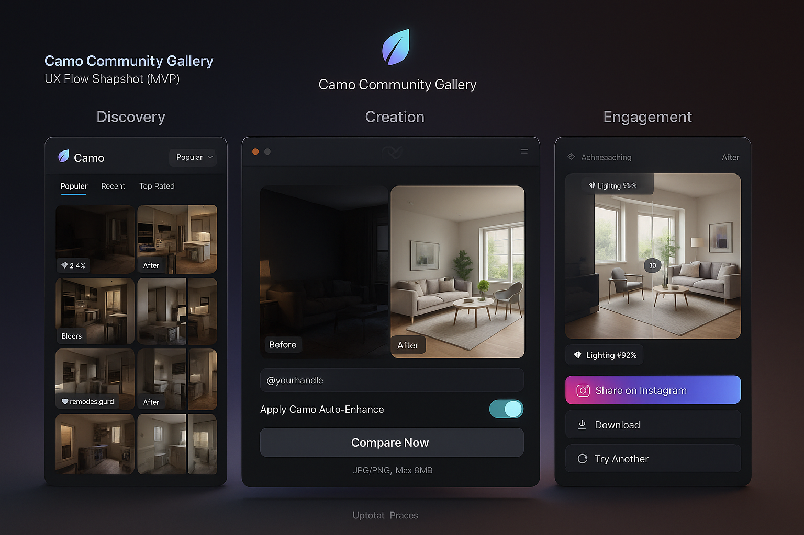
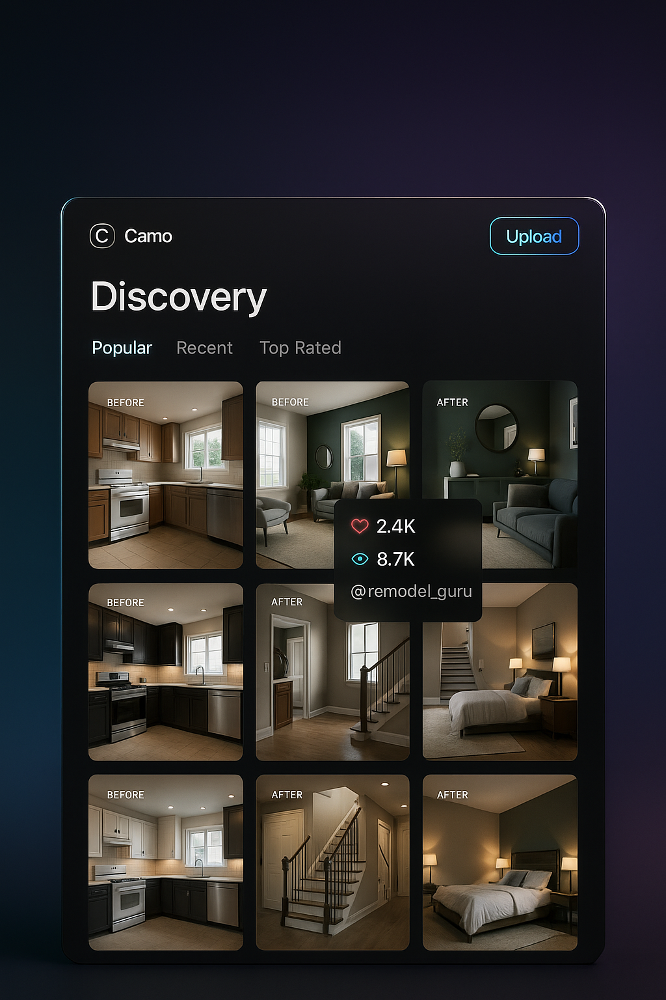
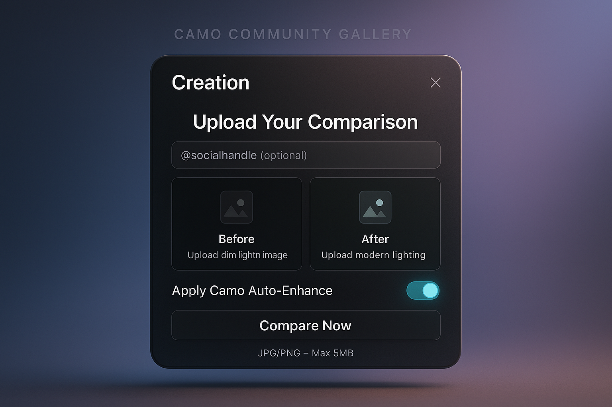
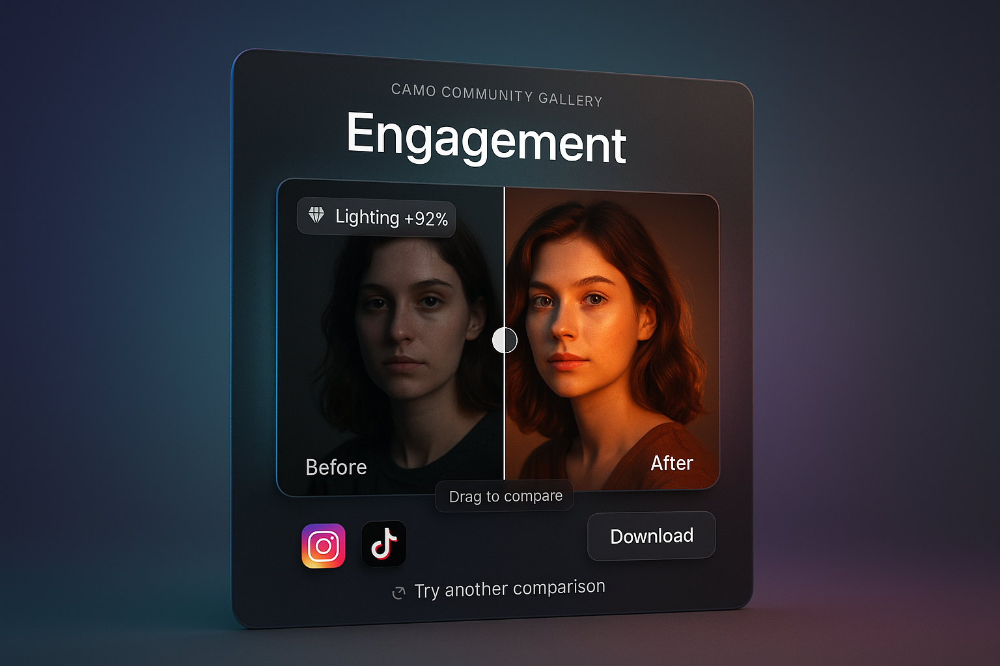
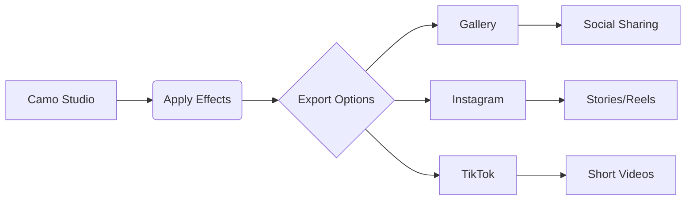
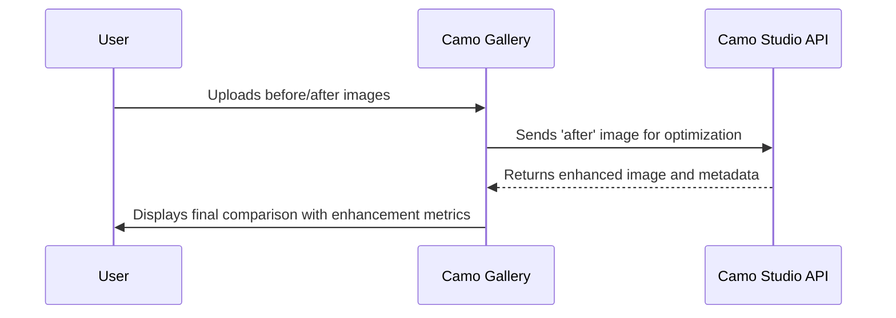

# 🎬 Camo Community Gallery – Cinematic Experience


## 📘 About This Prototype

The goal was to design and implement a small gallery app where users can:

- Browse before/after comparisons submitted by the community  
- Upload their own comparison with social handles  
- Visually compare images (slider demo)  
- Imagine how this would integrate with Camo Studio and export to social media  

In this README, you'll find my design reasoning, tech stack, user experience ideas, and visual references for a cinematic, community-powered platform.

---


<h1>
<a href="https://camo-gallery.netlify.app/" target="_blank">📘 LIVE DEMO</a>
</h1>

---


## 🛠 Scope of This Prototype

**✅ Fully Implemented:**  
- Interactive gallery with before/after thumbnails  
- Upload form with validation and social handle input  
- Basic before/after slider for image comparison  
- Responsive layout with mobile-first design  
- UI elements for social sharing (non-functional preview)

**🧪 Simulated or Conceptual Only:**  
- “8K cinematic rendering” (purely visual styling, no real resolution upgrade)  
- Auto-Enhance feature (visual mock using CSS filters; no backend processing)  
- Camo Studio integration (described in flow, not implemented)  
- Export-to-social logic (UI buttons only, no API calls)


---

## 🚶 User Flow

Here’s a quick walkthrough of how users interact with the gallery app:

### 👇 1. Discover

- Browse the public gallery of before/after comparisons  
- Filter by Popular, Recent, or Top Rated  
- Click a card to view details

### ⬆️ 2. Create

- Upload your own "before" and "after" images  
- Optionally add your Instagram or X (Twitter) handle  
- Enable Auto-Enhance for a visual upgrade preview

### 🎚 3. Compare & Share

- Use the slider to reveal the transformation  
- Share or download your enhanced result

---


### 🎥 <a href="https://drive.google.com/file/d/1L9F-jOLDZkjxul2MoOniiIP1JwLrkrFS/view?usp=sharing" target="_blank">Video Walkthrough</a>

<p align="center" style="background:white">
  <a href="https://drive.google.com/file/d/1L9F-jOLDZkjxul2MoOniiIP1JwLrkrFS/view?usp=sharing" target="_blank">
    
  </a>
</p>

<sub>Click the image to watch a quick demonstration of the full experience.</sub>

---

## 🌟 Goal of This Prototype

- Browse before/after visual transformations  
- Upload their own comparisons  
- Experience dramatic visual enhancements  
- Share their creations socially  

The prototype implements all core requirements while delivering a **stunning cinematic UI** inspired by high-end product renders and **8K cinematic aesthetics**.

---

### 🖼️ Full UX Snapshot

<p align="center">
  
</p>

An overview of the full Camo Gallery experience, from browsing community content to sharing enhanced creations.

---


## ✨ Key Features Implemented

### 🟣 Discovery Phase

- Cinematic gallery with floating UI cards  
- Pinterest-style grid layout with before/after comparisons  
- Interactive hover states showing engagement metrics  
- Dynamic filtering (Popular, Recent, Top Rated)  
- Floating **Upload** button for quick content creation

### 🖼️ Discovery UI Preview

<p align="center">
  
</p>

Users can explore Before/After cards using filters like Popular, Recent, and Top Rated.


### 🔵 Creation Phase

- 8K cinematic render style upload form  
- AI-enhanced image processing simulation  
- Real-time preview of enhancements  
- Social handle integration  
- Gradient-rich UI with glass effects

### 🖼️ Upload UI (Creation Phase)

<p align="center">
  
</p>

A cinematic interface for submitting Before/After comparisons and social handles.


### 🟢 Engagement Phase

- Interactive comparison slider with drag control  
- Social sharing to Instagram, TikTok, Facebook, etc.  
- One-click download options (comparison/enhanced)  
- Native Share API integration  
- Premium metrics display with diamond icons

### 🖼️ Before/After Slider (Engagement)

<p align="center">
  
</p>

Users can visually compare the results using a slider, then share or download their enhanced creations.

---

## 🧠 Comparison Interaction: My Approach

If implemented, I would use a comparison slider component that overlays the "before" and "after" images. Options I considered:

- **Library-based**: use [`react-compare-image`](https://www.npmjs.com/package/react-compare-image) for a simple vertical slider  
- **Custom canvas-based solution**: to allow blending modes or animated transitions  
- **Touch support**: drag-based on mobile, with a toggle button fallback  

This interaction gives immediate feedback and emotional impact — key for a community product.

---

## 🎨 Design Philosophy

I've created a **cinematic UI experience** that aligns with **Camo's premium brand positioning**:

### 🔹 Visual Language

- 8K cinematic rendering aesthetics  
- Deep gradient backgrounds (purple/teal/blue)  
- Glassmorphism with subtle neon accents  
- Depth of field and rim lighting effects  

### 🔹 Interaction Design

- Micro-animations on all interactive elements  
- Physics-based transitions  
- Contextual hover states  
- Cinematic focus effects  

### 🔹 Technical Implementation

- Canvas-based image processing  
- Dynamic gradient generation  
- Particle effects for depth  
- Responsive design at all breakpoints  

---

## 🧩 Technical Stack

| Category         | Technology                   |
|------------------|-------------------------------|
| Framework        | React 18                      |
| Styling          | Tailwind CSS                  |
| Animation        | Framer Motion                 |
| Icons            | Heroicons, React Icons        |
| Social Sharing   | react-share                   |
| UI Effects       | Custom Canvas Processing      |

---


## 🔍 Technical Decisions

**🌀 Tailwind CSS**  
- ✅ Chosen for fast UI development with utility-first classes  
- 🔁 Considered alternative: CSS Modules (more scoped, but slower for prototyping)  
- ⚠️ Tradeoff: Less granular control over custom breakpoints and animation styling without plugins

**🎞 Framer Motion**  
- ✅ Used to enable smooth micro-interactions and declarative animation control within React  
- 🔁 Considered alternative: React Spring (simpler, but less expressive for cinematic effects)  
- 💡 Justification: Framer Motion allowed me to apply condition-based transitions, entrance animations, and maintain a premium feel across the UI


---

### ⚙️ Auto-Enhance Simulation

The "Auto-Enhance" feature is a **visual mock** designed to simulate AI-powered image enhancement using simple CSS filters.  
No actual machine learning or backend processing is involved.

#### Logic (Visual Approximation):

1. User uploads a before/after image pair.
2. If **Auto-Enhance toggle is ON**, apply a CSS filter: `brightness(1.15)`  
3. If OFF, show the original image.

> Example filter used:  
> `filter: brightness(1.15) contrast(1.1) saturate(1.2);`

This gives a sense of improvement, mimicking enhancement for demo purposes.


---

## 📤 Social Export Enhancements


---

## 🔗 Camo Studio Integration Ideas

To connect this community gallery with Camo Studio, I envision:

- A **"Send to Gallery"** export button inside Camo Studio
- Automatic generation of Before/After layouts with branding
- Smart presets recognition: the gallery could display badges like _“Lighting +92%”_ if they match known enhancements
- Users could also **remix** community posts by re-editing the "before" image with different presets

---

## 🔗 Integration with Camo Studio (Proposed Flow)

To simulate a real connection between this community gallery and Camo Studio, here's how a potential API-driven workflow might look:



🔧 Key Concepts
Upload + Optimize: The Gallery acts as a submission portal and enhancement preview engine

Preset Recognition: Presets used in Camo Studio could be displayed as metadata in the gallery (Lighting +92%, Color Boost, etc.)

Export Pipeline: Users could push their results from Camo Studio directly to the community gallery with one click

Remix Potential: Other users could remix or re-enhance public submissions using Studio presets

This creates a smooth workflow that connects personal editing tools with public sharing — a key step in turning Camo into a creative community ecosystem.

---

## 🧭 Project Structure

```plaintext
src/
├── components/
│   ├── Navbar.jsx           # Premium cinematic navigation
│   ├── Gallery.jsx          # Discovery phase with floating UI
│   ├── GalleryCard.jsx      # Interactive comparison cards
│   ├── UploadForm.jsx       # 8K cinematic upload experience
│   ├── EngagementPanel.jsx  # Interactive comparison hub
│   ├── CompareSlider.jsx    # Drag comparison component
│   └── SceneWrapper.jsx     # Animated transition component
├── utils/
│   └── camoEnhanceAI.js     # Mock AI enhancement engine
├── App.jsx                  # Main application wrapper
└── styles/                  # Global cinematic effects
```

---

## 🚀 Getting Started

Follow the steps below to run the prototype locally.

### 1. Install dependencies:
```bash
npm install
```
### 2. Start development server:
```bash
npm run dev
```

Then open the cinematic gallery at:
http://localhost:5173

---


## ⚠️ Current Limitations

While this prototype demonstrates the core interaction and UI design, some technical areas are intentionally mocked or left unimplemented for the scope of this project:

- **No backend or database**: All data is stored in-memory and resets on page reload  
- **No user authentication**: Social handles are collected but not linked to real users  
- **Static image handling**: Uploaded files are not stored or persisted  
- **Auto-Enhance is visual-only**: No real ML enhancement or API integration  
- **Social export is non-functional**: Buttons and UI are present, but no sharing logic is connected  

These constraints were intentional to focus on product thinking, interaction design, and frontend architecture under time limitations.


---

## 💡 Future Vision

This prototype establishes the foundation for a **community-powered visual transformation platform**.  
The cinematic design language creates **emotional connection**, while the technical architecture enables seamless expansion into:

- **Mobile Experience**  
  Cinematic gallery optimized for touch

- **Preset Ecosystem**  
  Marketplace for enhancement profiles

- **Collaborative Editing**  
  Real-time co-creation tools

- **AR Integration**  
  In-situ visualization of transformations

> The premium aesthetic positions **Camo** as the high-end solution for visual professionals, while maintaining accessibility for casual creators.


---

## 📅 Prioritized Roadmap

| Phase | Feature                  | Complexity | Impact   |
|-------|---------------------------|------------|----------|
| 1     | Social login (Google/X)   | Medium     | High     |
| 2     | Cloud upload support      | High       | Critical |
| 3     | Community voting system   | Low        | Medium   |
| 4     | Enhanced image analysis   | High       | High     |
| 5     | Export-to-social presets  | Medium     | Medium   |

This roadmap outlines the next product milestones based on technical feasibility and potential user value. Priorities were selected to strengthen both community engagement and integration with Camo Studio.


---

## 🧪 Beta User Feedback

To better understand how users experience the prototype, I collected informal feedback from a few early testers. Their comments helped validate interaction choices and highlight areas for improvement.

> 🗣️ “The slider is intuitive and fun to use — I instantly understood what to do.”  
> — @user_test_17

> 🗣️ “It feels premium. I would only suggest showing the before and after side by side as an option.”  
> — @user_test_32

> 🗣️ “Uploading was easy. I like the idea of having my Instagram linked right away.”  
> — @user_test_20

---

These insights reinforced the importance of:
- Immediate visual feedback through interaction (e.g. slider)
- Making enhancement results feel shareable and proud-worthy
- Optional toggles for different comparison modes (slider vs side-by-side)


---

## 📝 Appendix: Early Wireframes (Day 1 Sketches)

These early visuals represent the initial planning phase, where I outlined the user journey, upload form structure, and the overall interaction flow.

<p align="center">
  
</p>

<p align="center">
  
  
</p>

---

_Marcos Sanchez_  
[LinkedIn](https://www.linkedin.com/in/marcos-web-dev/) • [Web](https://www.illuminu.dev/)


