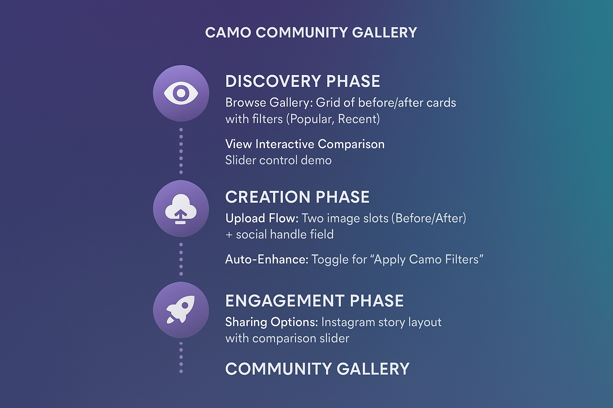
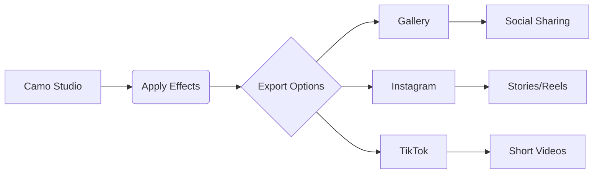
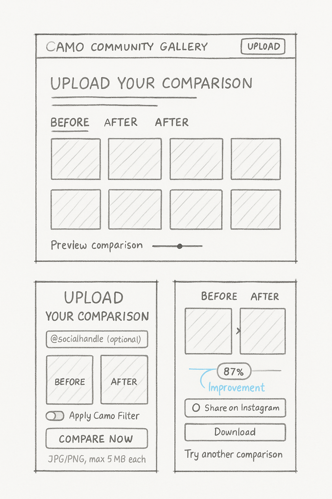
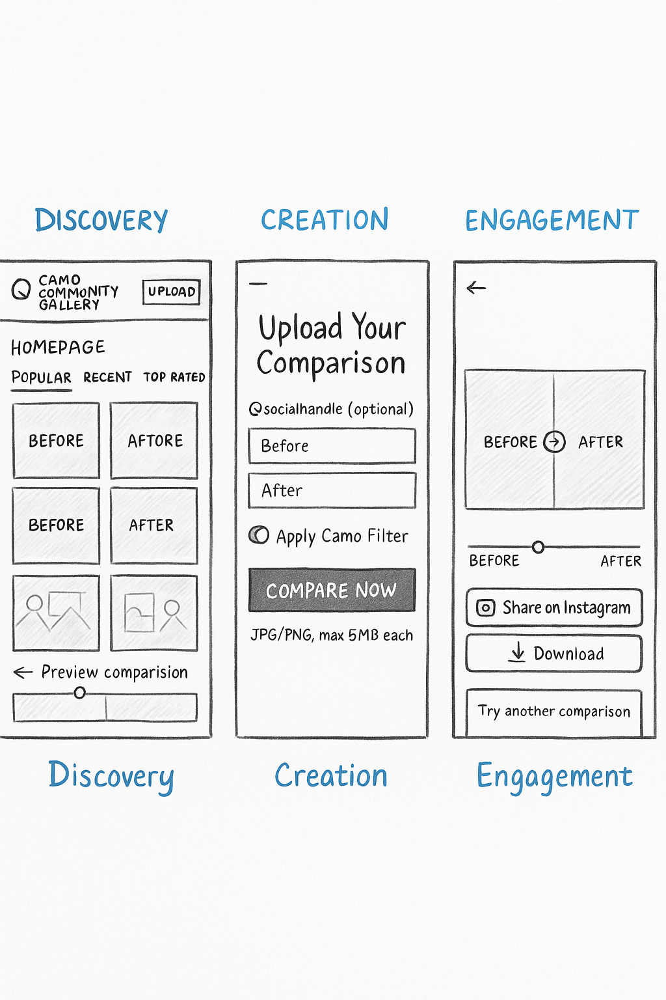

# 🎬 Camo Community Gallery – Cinematic Experience

## 🌟 Introduction

This project is a technical assessment for **Camo**, showcasing a premium cinematic gallery experience where users can:

- Browse before/after visual transformations  
- Upload their own comparisons  
- Experience dramatic visual enhancements  
- Share their creations socially  

The prototype implements all core requirements while delivering a **stunning cinematic UI** inspired by high-end product renders and **8K cinematic aesthetics**.

<p align="center">

</p>

---

## ✨ Key Features Implemented

### 🟣 Discovery Phase

- Cinematic gallery with floating UI cards  
- Pinterest-style grid layout with before/after comparisons  
- Interactive hover states showing engagement metrics  
- Dynamic filtering (Popular, Recent, Top Rated)  
- Floating **Upload** button for quick content creation  

### 🔵 Creation Phase

- 8K cinematic render style upload form  
- AI-enhanced image processing simulation  
- Real-time preview of enhancements  
- Social handle integration  
- Gradient-rich UI with glass effects  

### 🟢 Engagement Phase

- Interactive comparison slider with drag control  
- Social sharing to Instagram, TikTok, Facebook, etc.  
- One-click download options (comparison/enhanced)  
- Native Share API integration  
- Premium metrics display with diamond icons  

---

## 🎨 Design Philosophy

I've created a **cinematic UI experience** that aligns with **Camo's premium brand positioning**:

### 🔹 Visual Language

- 8K cinematic rendering aesthetics  
- Deep gradient backgrounds (purple/teal/blue)  
- Glassmorphism with subtle neon accents  
- Depth of field and rim lighting effects  

### 🔹 Interaction Design

- Micro-animations on all interactive elements  
- Physics-based transitions  
- Contextual hover states  
- Cinematic focus effects  

### 🔹 Technical Implementation

- Canvas-based image processing  
- Dynamic gradient generation  
- Particle effects for depth  
- Responsive design at all breakpoints  

---

## 🧩 Technical Stack

| Category         | Technology                   |
|------------------|-------------------------------|
| Framework        | React 18                      |
| Styling          | Tailwind CSS                  |
| Animation        | Framer Motion                 |
| Icons            | Heroicons, React Icons        |
| Social Sharing   | react-share                   |
| UI Effects       | Custom Canvas Processing      |

---

## 📤 Social Export Enhancements


---

## 🧭 Project Structure

```plaintext
src/
├── components/
│   ├── Navbar.jsx           # Premium cinematic navigation
│   ├── Gallery.jsx          # Discovery phase with floating UI
│   ├── GalleryCard.jsx      # Interactive comparison cards
│   ├── UploadForm.jsx       # 8K cinematic upload experience
│   ├── EngagementPanel.jsx  # Interactive comparison hub
│   ├── CompareSlider.jsx    # Drag comparison component
│   └── SceneWrapper.jsx     # Animated transition component
├── utils/
│   └── camoEnhanceAI.js     # Mock AI enhancement engine
├── App.jsx                  # Main application wrapper
└── styles/                  # Global cinematic effects
```

<p align="center">

</p>

---

## 🚀 Getting Started

Install dependencies:
npm install

Start development server:
npm run dev

Then open the cinematic gallery at:
http://localhost:5173


## 💡 Future Vision

This prototype establishes the foundation for a **community-powered visual transformation platform**.  
The cinematic design language creates **emotional connection**, while the technical architecture enables seamless expansion into:

- **Mobile Experience**  
  Cinematic gallery optimized for touch

- **Preset Ecosystem**  
  Marketplace for enhancement profiles

- **Collaborative Editing**  
  Real-time co-creation tools

- **AR Integration**  
  In-situ visualization of transformations

> The premium aesthetic positions **Camo** as the high-end solution for visual professionals, while maintaining accessibility for casual creators.

<p align="center">

</p>


_Marcos Sanchez_  
[LinkedIn](https://www.linkedin.com/in/marcos-web-dev/) • [Web](https://www.illuminu.dev/)


